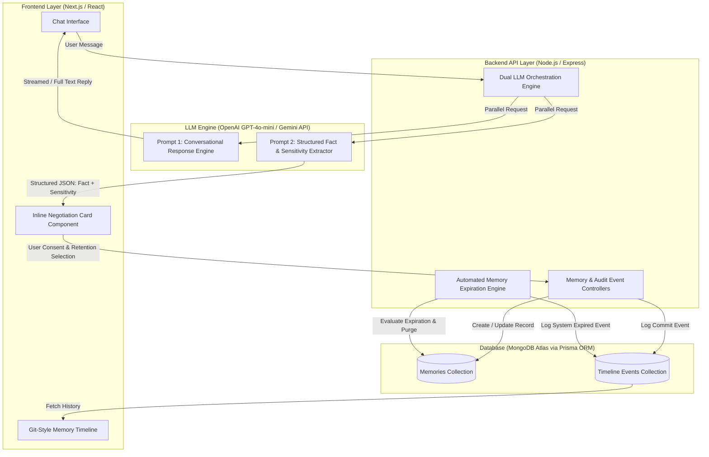

# MemCommit — Negotiated, Transparent AI Memory for Conversational Assistants

**ACM SIGCHI Supported Hackathon for Human-Centered Design of Large Language Model Interfaces**  
**Design Document**  
**Problem Statement ID:** PS06 — Negotiating AI Memory  
**Team Name:** 4-bit_Avengers  
**Team Members:**
1. Muskan Thakur
2. Arya Dhumal
3. Meet Shah
4. Harsh Lal

---

## Abstract
As conversational AI assistants become deeply personalized, they increasingly extract and retain facts about users across sessions — locations, habits, health details, financial goals — with little to no real-time visibility or control offered to the user. Existing memory features in commercial LLM products operate as opaque, settings-buried mechanisms: users can review or delete stored memories only after the fact, through nested account menus, rather than negotiating what gets remembered at the moment it happens. Recent CHI research confirms this gap directly, finding that users experience negative expectancy violations upon discovering what AI systems have retained about them, and express a strong, unmet need for greater visibility, transparency, and control. 

**MemCommit** addresses this gap by treating AI memory as an ongoing, in-context negotiation rather than a static configuration. When the system detects a durable personal fact during conversation, it interrupts the chat flow with an inline negotiation card offering explicit retention choices — *remember permanently*, *for one week*, *for this session only*, or *not at all* — before any data is stored. A Git-style timeline dashboard makes every memory transaction visible and editable after the fact, an automated expiration engine enforces the chosen retention window, and a sensitivity meter classifies extracted facts by risk level to raise user awareness. Together, these features shift memory from a passive extraction process the user must audit into an active, transparent, and continuously renegotiable relationship — directly operationalizing the transparency, in-context agency, and explainability principles this problem statement calls for.

**Keywords:** AI Memory, User Consent, Human-AI Interaction, Privacy by Design, Personalization, In-Context Agency

---

## 1. Introduction (Background & Motivation)

### 1.1 Problem Statement
**PS06 — Negotiating AI Memory**

### 1.2 Problem Description
* **What problem are we solving:** As AI assistants become more personalized, they increasingly remember user preferences, past questions, and personal details across conversations. Today, this happens largely as a black box — users have no meaningful, real-time way to see what is being remembered, decide what should be forgotten, or specify that something should apply only to the current conversation. Memory control, where it exists at all, is buried in static settings menus rather than surfaced as part of the interaction itself.
* **Why it is important:** Trust in AI assistants depends on users feeling in control of what the system knows about them. Without visible, ongoing consent, personalization risks becoming surveillance by default — users either over-share without realizing it, or under-utilize personalization features out of distrust. Recent research on commercial memory features (e.g., ChatGPT's memory) confirms that users are frequently surprised, and often unsettled, by what the system has retained, and consistently ask for more legible, negotiable control.
* **Who is affected:** Any user of a personalized conversational AI assistant — from casual daily users to professionals handling sensitive work or personal information — is affected. The problem is especially acute for privacy-conscious users who want the benefits of personalization without an accompanying loss of agency over their own data.

---

## 2. Literature Review

The following six sources were reviewed to ground the problem framing, identify what existing systems already address, and locate the specific gap MemCommit targets.

### 1. Relational Gains, Privacy Strains: Exploring Users' Perceptions and Experiences with ChatGPT's Memory Feature (CHI 2026)
This empirical study interviewed users of ChatGPT's memory feature and found four characteristics that distinguish AI memory from human memory in users' minds: *perceived unforgetfulness*, *detailedness*, *accuracy*, and a *lack of emotional nuance*. Critically, most participants reported negative expectancy violations after learning what the system had actually stored about them, and expressed a strong, consistent need for greater visibility, accessibility, transparency, and control over memory behavior. This paper most directly validates the premise of PS06 and is the primary research anchor for MemCommit's design principles.

### 2. Understanding Users' Privacy Perceptions Towards LLM's RAG-based Memory
This workshop study examines how users perceive retrieval-augmented, persistent LLM memory, finding that the ability of AI systems to recall personal details over time can create a chilling effect — a sense of being constantly monitored that leads some users to self-censor. The paper underscores that memory transparency is not just a convenience feature but a factor that shapes what users are willing to say to an AI assistant at all, reinforcing the importance of surfacing memory behavior at the point of disclosure rather than after the fact.

### 3. Towards Aligning Personalized AI Agents with Users' Privacy Preference
This paper addresses a harder variant of the memory problem: AI systems can often infer sensitive information about users (interests, circumstances, even identity attributes) without the user ever having explicitly stated it. The authors argue that alignment with user privacy preferences requires systems to reason about inferred, not just disclosed, information. While MemCommit's initial scope focuses on explicit fact extraction, this work informs the project's future-work direction toward handling inferred rather than only stated facts.

### 4. Memolet: Reifying the Reuse of User-AI Conversational Memories (UIST 2024)
Memolet proposes a concrete interaction pattern for making AI memory tangible and reusable: individual memories are represented as discrete, manipulable objects a user can reference, reuse, or discard across conversations, rather than an invisible internal state. This directly informed MemCommit's decision to represent each memory as an explicit, editable object in a Git-style timeline rather than leaving memory as an opaque internal process.

### 5. Robust AI Personalization Will Require a Human Context Protocol (2025)
This position paper argues that truly personal, interoperable AI systems require a dedicated, user-owned architecture for preference and memory management — proposing a 'Human Context Protocol' of user-owned, consent-based repositories that individuals actively and reflectively control, rather than memory being an undifferentiated side effect of model infrastructure. This supports MemCommit's architectural choice to treat memory as a first-class, user-editable data object (via the Timeline and expiry engine) rather than an implicit property of the LLM API call.

### 6. Enabling Personalized Long-term Interactions in LLM-based Agents through Persistent Memory and User Profiles (2025)
This technical survey reviews architectural approaches to persistent memory in LLM-based agents, covering memory storage, retrieval, and profile-based personalization strategies. It provided useful grounding for MemCommit's technical architecture decisions, particularly the separation of a structured memory store (MongoDB + Prisma) from the conversational LLM layer, so that memory can be governed independently of model behavior.

> [!NOTE]
> **Identified Research Gap:** Across this literature, two consistent gaps emerge. First, almost all existing memory tooling (including commercial products like ChatGPT's memory) treats control as a post-hoc settings feature rather than an in-the-moment negotiation, despite users explicitly asking for the latter. Second, very little prior work operationalizes memory as a visible, ongoing relationship — most systems present memory as either fully automatic or fully manual, with no continuous, low-friction negotiation in between. MemCommit is designed specifically to close this second gap.

---

## 3. Proposed Solution

### Main Idea
MemCommit is a consent-driven wrapper around a conversational LLM that turns memory extraction into a visible, negotiated event rather than a silent background process. When the assistant detects a durable personal fact in the user's message, it pauses to ask — inline, in the chat itself — how long that fact should be remembered, before anything is stored.

### Key Features
* **Memory Negotiation Chat:** When a personal fact is detected, the system presents a "Remember this?" inline card instead of automatically storing the information. If enabled, users choose the retention period (**Permanent**, **1 Week**, or **This Session Only**); if disabled or dismissed, the memory is discarded. Users can also issue conversational overrides (e.g., *"Forget what I just said"*) or update memories through the Memory Dashboard.
* **Git-Style Memory Timeline:** A chronological, commit-history-style dashboard logging every memory event (**Created**, **Updated**, **Deleted**, **Expired**), complete with click-to-edit capabilities on any entry and event audit trail transparency.
* **Automated Memory Expiration Engine:** Enforces the retention window chosen at negotiation time, purging expired memories on session start / cron evaluation and logging the purge transparently as `"System Expired"`.
* **Privacy & Sensitivity Meter:** Automatically classifies each extracted fact as **Low** (Preferences, Hobbies), **Medium** (Locations, Schedules), or **High** (Health, Financials, Contact Info) sensitivity. Displayed as a visual badge alongside the memory, functioning like a nutrition label for personal data.

### Why This Solution Is Different
Commercial memory features (ChatGPT, Gemini, and comparable assistants) all default to silent extraction with after-the-fact review. MemCommit inverts this: consent is requested at the moment of disclosure, not audited after storage. This directly addresses the specific, repeated finding in the reviewed literature that users want negotiation, not just post-hoc visibility — and it does so without adding meaningful friction to the core conversational experience, since the negotiation card appears inline rather than interrupting the user's flow with a separate modal or settings screen.

---

## 4. Target Users

* **Primary Users:** Tech-literate professionals and students who rely on AI assistants for daily productivity but are skeptical of large tech companies profiling them, and who experience "privacy fatigue" from complex, buried settings menus.
* **Secondary Users:** General consumer LLM users who are curious about, but not deeply technical regarding, what personal data an AI assistant retains.

### Demographic & Psychographic Profile

| Attribute | Description |
| :--- | :--- |
| **Age Group** | 18–35 years old |
| **Education** | Undergraduate degree or higher |
| **Occupation** | Students, knowledge workers, early-career professionals, developers |
| **Digital Literacy** | High — comfortable with apps and web products, expects granular data control |
| **Language** | English primary; regional-language support a future consideration |
| **Environment** | Urban/semi-urban; desktop and mobile web usage |

---

## 5. User Persona

```
+-----------------------------------------------------------------------------------+
| USER PERSONA: Aanya Sharma                                                        |
| 21-year-old Engineering Student & Tech Enthusiast                                 |
+-----------------------------------------------------------------------------------+
| "I want my AI assistant to know my context without keeping a permanent dossier   |
| on every personal detail I mention during late-night study sessions."              |
+-----------------------------------------------------------------------------------+
```

* **Name:** Aanya Sharma
* **Background:** 21-year-old final-year engineering student who uses AI assistants daily for coursework, career planning, project brainstorming, and personal organization.
* **Goals:** Wants an assistant that remembers useful context (deadlines, preferred coding languages, ongoing project goals) so she doesn't have to repeat herself in every new chat.
* **Frustrations:** Has been unsettled before when an assistant referenced something personal she didn't remember explicitly sharing or agreeing to have stored. Dislikes digging through 5-level-deep account settings just to delete a single retained phrase.
* **Needs:** Wants simple, in-the-moment control over what's remembered, with clear expiration timelines (e.g., remember a project deadline for a week, not forever).
* **Technical Proficiency:** High comfort with everyday web apps and AI tools; privacy-conscious consumer.

---

## 6. User Journey

The following table illustrates how users currently experience AI memory, the associated pain points, and how MemCommit improves each stage:

| Stage | Current Experience | Pain Point | Proposed Solution (MemCommit) |
| :--- | :--- | :--- | :--- |
| **Data Extraction** | AI silently records facts shared during conversation in the background. | User is unaware that anything was stored at all (Expectancy Violation). | The assistant explicitly asks for permission, inline, the moment a fact is detected. |
| **Data Retention** | Data is kept indefinitely by default until the user manually finds and deletes it. | No control over how long something is kept unless the user proactively intervenes. | User assigns an explicit retention period (Session / 7 Days / Permanent) upfront. |
| **Data Audit** | User must dig through nested account settings to review or export stored data. | High-friction, opaque process that most users never actually complete. | A one-click, Git-style chronological timeline shows every memory event clearly. |

---

## 7. Design Process

* **User Assumptions:** Users increasingly want personalized AI assistance but are simultaneously more privacy-aware than ever, and experience "privacy fatigue" from settings-heavy products; trust is built primarily through visibility and control, not through additional configuration complexity.
* **Research & Observations:** The design was grounded directly in the CHI 2026 finding that users feel expectancy violations upon discovering AI memory content, and in workshop research on the chilling effect of opaque, persistent memory — both pointing to the same underlying need for real-time, legible negotiation rather than post-hoc review.
* **Brainstorming & Alternatives Considered:**
  1. *Pure Settings-Panel Control Center:* Rejected, as literature criticizes static menus as insufficient and high-friction.
  2. *Fully Automatic "Smart" Memory:* Rejected, as it removes user agency entirely and perpetuates the black-box issue.
  3. *Inline Conversational Negotiation Model:* **Selected**, as it captures consent at the point of disclosure.
* **Concept Selection:** The team combined in-the-moment negotiation (for control) with a persistent Git-style timeline (for post-hoc transparency and auditability), addressing both real-time agency and long-term legibility.
* **Iterations:** Calibrated intervention friction — optimizing when the negotiation card interrupts versus staying unobtrusive, drawing on friction-design lessons from privacy-intervention research to prevent notification fatigue.

---

## 8. Interface Design & Wireframes

### Screen 1 — Chat Interface (Home) with Inline Negotiation Card

The primary conversational surface. User messages and AI replies render as a standard chat thread. When a personal fact is detected in a user message, the Negotiation Card renders inline directly beneath that message, before the AI's reply.

```
+----------------------------------------------------------------------------------+
| MemCommit Header                           [ Memory Timeline Dashboard Toggle ]  |
+----------------------------------------------------------------------------------+
|                                                                                  |
| [User] I'm preparing for my final exam in Pune next Thursday, focusing on DBMS.   |
|                                                                                  |
| +------------------------------------------------------------------------------+ |
| | [?] MEMORY NEGOTIATION CARD                           [Badge: MEDIUM RISK]  | |
| | Detected Fact: "User is taking DBMS final exam in Pune next Thursday"        | |
| |                                                                              | |
| | Remember this fact?                                                          | |
| | (o) Permanent   ( ) 7 Days   ( ) This Session Only   [ Cancel / Reject ]     | |
| |                                                                              | |
| | [ Confirm & Save Memory ]                                                    | |
| +------------------------------------------------------------------------------+ |
|                                                                                  |
| [Assistant] Got it! Good luck with your DBMS exam preparation. Let's break down   |
| relational algebra and indexing topics...                                       |
|                                                                                  |
+----------------------------------------------------------------------------------+
| [ Type your message...                                               ] [ Send ]  |
+----------------------------------------------------------------------------------+
```

### Screen 2 — Negotiation Card (Inline Component Detail)

An inline, dismissible component that appears when a personal fact is detected. It displays a "Remember this?" toggle, retention duration options, and a Privacy Sensitivity Badge.

```
+------------------------------------------------------------------------------+
| 🔍 FACT DETECTED                              [ Privacy Badge: LOW / MED / HIGH ] |
| Fact: "Prefers Python for data analysis tasks"                               |
| ---------------------------------------------------------------------------- |
| Retention Window:                                                            |
|  [ ⚡ This Session ]   [ 🗓️ 7 Days ]   [ ♾️ Permanent ]   [ 🚫 Do Not Remember ]|
| ---------------------------------------------------------------------------- |
|  [ ✓ Save Choice ]                                                           |
+------------------------------------------------------------------------------+
```

### Screen 3 — Memory Timeline (Sidebar Dashboard)

Accessed via a sidebar toggle from the Chat Interface. Displays a vertical, Git-style commit history of memory events (**Created** / **Updated** / **Deleted** / **Expired**) with timestamps and sensitivity badges.

```
+----------------------------------------------------------------------------------+
| GIT-STYLE MEMORY TIMELINE                                           [ Close X ]  |
+----------------------------------------------------------------------------------+
|                                                                                  |
|  🟢 COMMIT 8f9a12 - CREATED                                [ 2026-08-07 14:20 ]  |
|     Fact: "Prefers Python for data analysis"                                     |
|     Retention: Permanent | Sensitivity: LOW                                      |
|     [ View / Edit ]  [ Delete ]                                                  |
|     |                                                                            |
|  🟡 COMMIT 4c2b71 - UPDATED                                [ 2026-08-07 15:05 ]  |
|     Fact: "Target exam date updated to Aug 15"                                   |
|     Retention: 7 Days | Sensitivity: MEDIUM                                      |
|     [ View / Edit ]  [ Delete ]                                                  |
|     |                                                                            |
|  🔴 COMMIT e11d09 - SYSTEM EXPIRED                         [ 2026-08-07 19:00 ]  |
|     Fact: "Temporary session query context"                                      |
|     Retention: Session | Status: PURGED                                          |
|                                                                                  |
+----------------------------------------------------------------------------------+
```

### Screen 4 — Memory Detail / Edit Modal

Triggered by clicking any entry in the Timeline. Allows the user to view full memory content, change its expiration window, or delete it directly.

```
+------------------------------------------------------------------------------+
| EDIT MEMORY RECORD #8f9a12                                       [ Close X ] |
+------------------------------------------------------------------------------+
| Content: "Prefers Python for data analysis"                                 |
| Sensitivity: LOW RISK                                                       |
|                                                                              |
| Update Expiration:                                                           |
| [ Select Expiration: 7 Days ▼ ]                                              |
|                                                                              |
| Audit History: Created via Chat Negotiation on Aug 7, 2026 at 14:20         |
|                                                                              |
| [ Update Retention ]     [ 🗑️ Delete Memory Permanently ]                   |
+------------------------------------------------------------------------------+
```

---

## 9. Technical Architecture & Data Flow



### Architectural Breakdown
* **Frontend:** Next.js, React, Tailwind CSS — Provides responsive chat interface, inline negotiation component, and sidebar commit-history dashboard.
* **Backend:** Node.js, Express.js — API routing, dual-prompt LLM orchestration, and business logic.
* **AI Models/APIs:** OpenAI GPT-4o-mini (or Gemini API) — Dual-prompt design: One prompt generates the conversational reply, a parallel prompt performs structured JSON fact extraction and sensitivity classification.
* **Database & ORM:** MongoDB Atlas with Prisma ORM — Flexible document storage for memory records and immutable timeline audit events.
* **Expiration Engine:** Backend worker evaluating `expiresAt` timestamps on session startup or cron, purging stale data and recording `"System Expired"` entries.

---

## 10. Results and Discussion

* **Who Benefits:** Any user of a personalized AI assistant who wants the value of memory-driven personalization without losing visibility or agency over their own data — particularly privacy-conscious students and professionals.
* **How It Improves Existing Workflows:** **MemCommit** replaces blind, after-the-fact trust in AI memory with informed, ongoing consent, without adding meaningful friction to the core conversational experience — negotiation happens inline, at the moment of disclosure, not as a separate step the user must seek out.
* **Scalability:** Yes. The architecture is a lightweight wrapper around any LLM API rather than a modification to the underlying model, meaning the negotiation, timeline, expiry, and sensitivity-classification pattern can be layered onto virtually any conversational AI product with minimal integration effort.

---

## 11. Future Work

* **Memory Provenance in Chat:** Inline-highlighting which stored memory a given AI reply drew on, and when it was saved, at the moment of use rather than only in the Timeline.
* **Memory Conflict Detection:** Surfacing a reconciliation prompt when a new statement contradicts an existing memory, instead of silently overwriting or keeping stale data.
* **Consent Preview:** Showing a one-line preview of what remembering a fact will enable, before the user chooses a retention option, to make consent more genuinely informed.
* **Bulk Category Negotiation:** Supporting commands like *"forget everything about my health"* as a category-level action, not just single-fact deletion.
* **Proactive Memory Check-ins:** The assistant occasionally surfacing memories nearing expiration and asking whether to extend or let them go, reinforcing memory as an ongoing relationship.
* **With/Without Memory Toggle:** Letting a user instantly replay the last exchange without stored memory applied, to make the value of consented memory tangible.
* **Confidence-Gated Extraction:** Phrasing uncertain fact extractions as clarifying questions rather than flat assertions, using the extraction model's own confidence score.

---

## 12. References

[1] Relational Gains, Privacy Strains: Exploring Users' Perceptions and Experiences with ChatGPT's Memory Feature. *Proceedings of the 2026 CHI Conference on Human Factors in Computing Systems*. [https://dl.acm.org/doi/10.1145/3772318.3791635](https://dl.acm.org/doi/10.1145/3772318.3791635)  
[2] Understanding Users' Privacy Perceptions Towards LLM's RAG-based Memory. *Proceedings of the 2025 Workshop on Human-Centered AI Privacy and Security*. [https://dl.acm.org/doi/10.1145/3733816.3760750](https://dl.acm.org/doi/10.1145/3733816.3760750)  
[3] Towards Aligning Personalized AI Agents with Users' Privacy Preference. *Proceedings of the 2025 Workshop on Human-Centered AI Privacy and Security*. [https://dl.acm.org/doi/full/10.1145/3733816.3760752](https://dl.acm.org/doi/full/10.1145/3733816.3760752)  
[4] Yen, R. and Zhao, J. 2024. Memolet: Reifying the Reuse of User-AI Conversational Memories. *Proceedings of the 37th Annual ACM Symposium on User Interface Software and Technology (UIST '24)*.  
[5] Shah, A. V. Robust AI Personalization Will Require a Human Context Protocol. 2025. [https://miba.dev/assets/publications/HCP_ArXiv_2025.pdf](https://miba.dev/assets/publications/HCP_ArXiv_2025.pdf)  
[6] Enabling Personalized Long-term Interactions in LLM-based Agents through Persistent Memory and User Profiles. 2025. [https://www.researchgate.net/publication/396373172](https://www.researchgate.net/publication/396373172)  
[7] OpenAI API Documentation (Chat Completions). [https://platform.openai.com/docs](https://platform.openai.com/docs)  
[8] MongoDB Atlas Documentation. [https://www.mongodb.com/docs/atlas/](https://www.mongodb.com/docs/atlas/)  
[9] Prisma ORM Documentation. [https://www.prisma.io/docs](https://www.prisma.io/docs)  
[10] Next.js Documentation. [https://nextjs.org/docs](https://nextjs.org/docs)  
